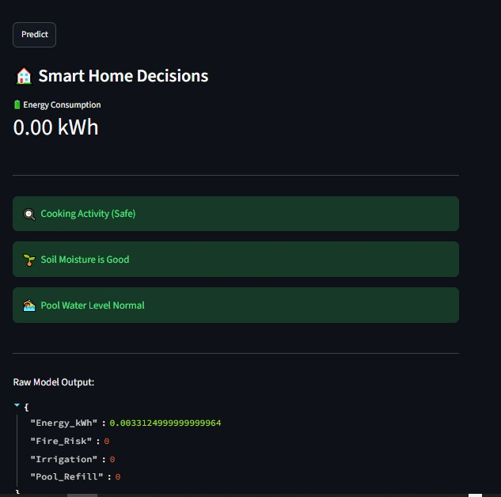
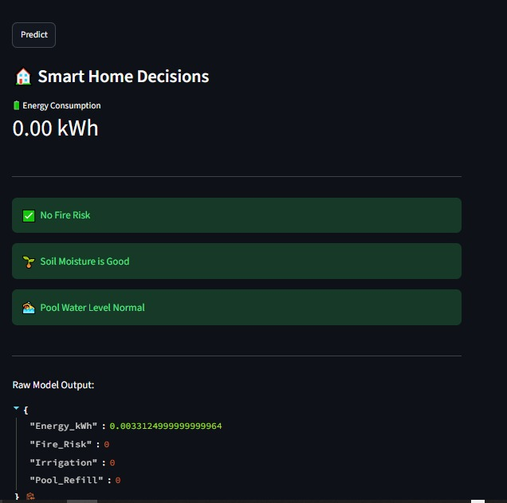
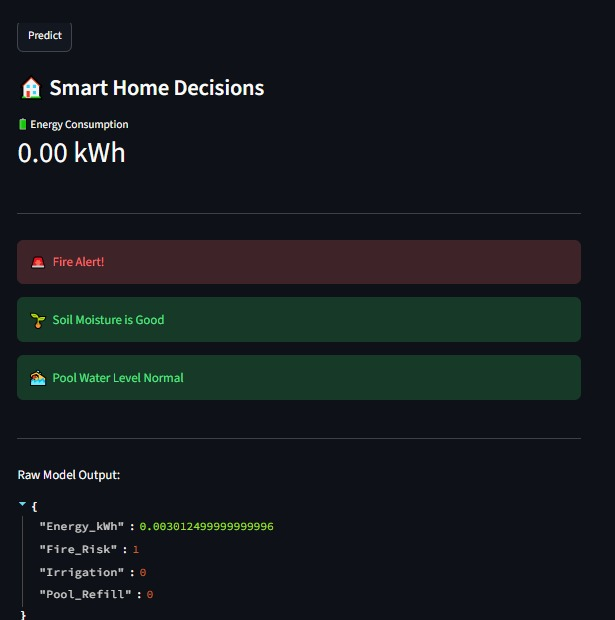
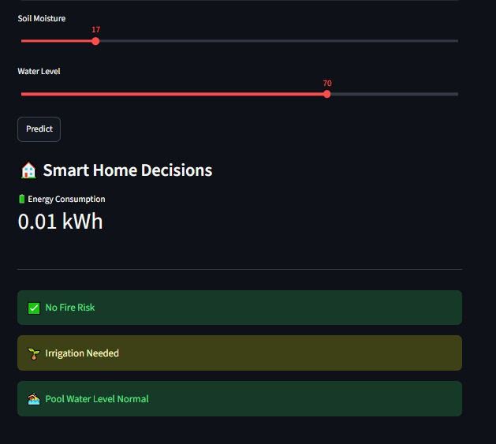
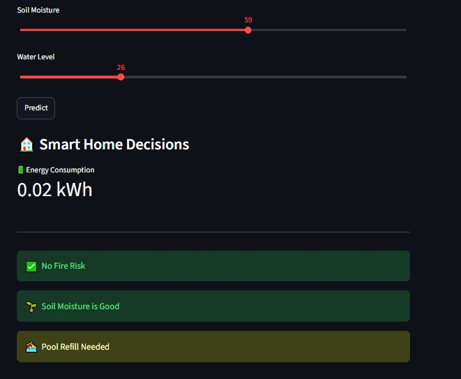

# 🏠 AI-Based Smart Home Security System

## 📖 Overview

This project was developed as part of my graduation project to build an AI-powered Smart Home Security and Automation System.

My primary contribution focused on designing, developing, training, and integrating the Machine Learning module into an interactive Streamlit dashboard.

---

## 👨‍💻 My Contribution

- Developed and trained four Machine Learning models.
- Built an interactive Streamlit dashboard using Streamlit.
- Integrated all trained models into one application.
- Tested and evaluated prediction performance.
- Improved model accuracy through preprocessing and evaluation.

---

## 📊 Machine Learning Models

| Model | Purpose |
|-------|---------|
| ⚡ Energy Consumption Prediction | Predict home energy consumption |
| 🔥 Fire Detection | Detect fire risks |
| 🌱 Irrigation Prediction | Predict irrigation requirements |
| 🏊 Pool Monitoring | Predict swimming pool refill requirements |

---

## 🤝 Team Contributions

This project was completed as a graduation team project.

Other team members contributed to:

- ESP32 Programming
- Hardware Implementation
- MQTT Communication
- Cloud Integration

---

## 🛠 Technologies Used

- Python
- Streamlit
- Scikit-learn
- Joblib
- Pandas
- NumPy

---

# 📸 Project Screenshots

## Dashboard


---

## Cooking Activity (Safe)


---

## Cooking Activity (Another Example)



---

## No Fire Risk



---

## Fire Alert


---

## Fire Alert (Another Example)



---

## Irrigation Needed



---

## Pool Refill Needed



---

## 🚀 How to Run

### Install dependencies

```bash
pip install -r requirements.txt
